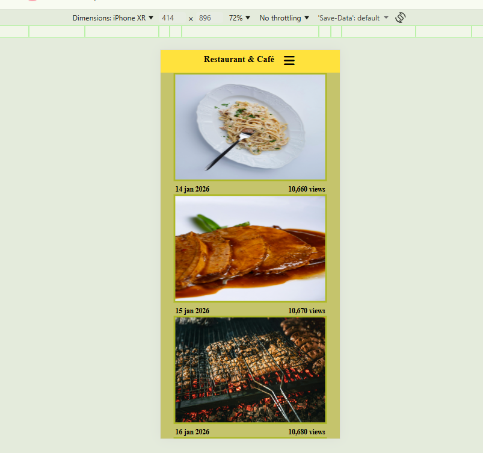

# 🌐 Multipage Website

Welcome to my **Multipage Website** project! 👋  
This is a fully responsive, modern multipage website built using **HTML, CSS, and JavaScript**, ideal for showcasing small businesses, portfolios, or personal websites.

👉 Live Demo: https://multiplepages-website.netlify.app/

---

## 📌 About This Project

This project is a **multipage website** designed to:

- Provide multiple pages like Home, About, Services, and Contact  
- Showcase modern layout and design skills  
- Demonstrate responsive design for desktop and mobile devices  
- Include navigation, images, and interactive elements

---

## 📌 Features

- Fully responsive layout  
- Smooth navigation between pages  
- Clean and modern UI design  
- Image gallery or sections with placeholder content  
- Interactive elements using JavaScript (optional)

---

## 📌 Tech Used

- **HTML5** – Structure of the website  
- **CSS3** – Styling & layout  
- **JavaScript** – Interactivity & dynamic behavior  
- **Responsive design** – Mobile friendly

---

## 📌 Screenshots

  
  
  

## 📌 How to Run Locally

git clone https://github.com/md-rubel-ahmed/multipage-website.git
